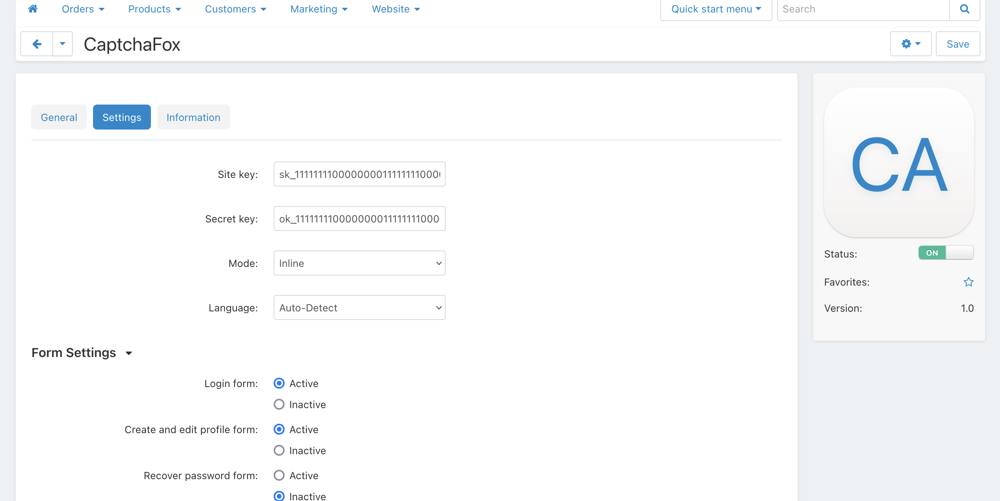
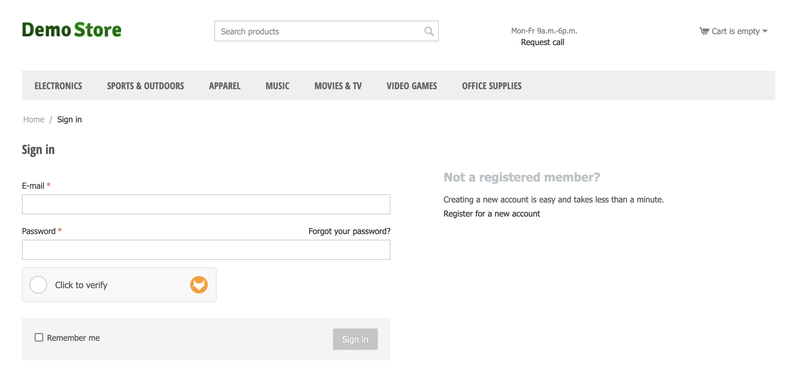

# CaptchaFox Add-on for CS-Cart

[CaptchaFox](https://captchafox.com/) is a user-friendly and GDPR compliant captcha service that protects your website and mobile apps from malicious bot traffic.

This add-on integrates CaptchaFox with CS-Cart forms.

## Installation

1. Navigate to **Add-ons** > **Manage add-ons**
2. Click on the gear icon and select **Manual installation**
3. Upload the `captchafox.zip` file (From your local disk or using the URL from the [Release](https://github.com/CaptchaFox/captchafox-addon-cs-cart/releases))
4. Activate the plugin on the **Add-ons** page and click on the plugin name to open its settings
5. Enter your Site Key and Secret Key in the **Settings** tab
6. Enable CaptchaFox for the available forms

## Screenshots
Settings

Demo

## Credits

This add-on is based on the integrated recaptcha add-on from cs-cart.
